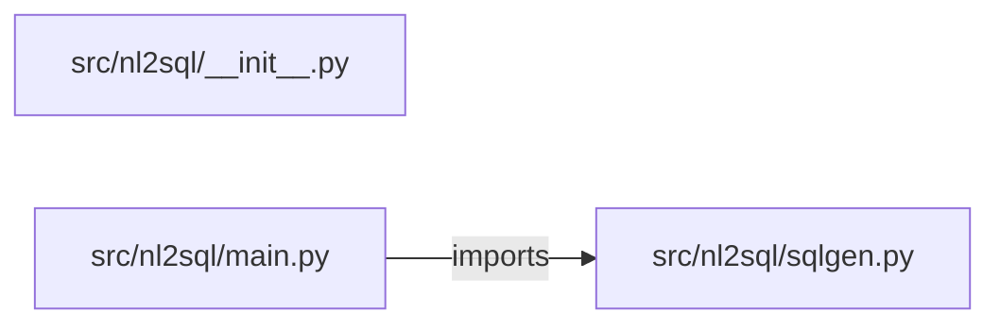

# nl-to-sql-generator — project architecture

[README](README.md) · [Interview questions and answers](INTERVIEW_QA.md)

## Purpose and scope

Map a question onto a read-only SELECT. Writes are refused.

This document describes files and symbols in this checkout. Deployment templates and statements in the original overview are distinguished from a verified running environment.

## Component diagram



For Python repositories, arrows show resolved local imports, not network calls or deployment order. Otherwise the diagram is a repository component map; containment arrows do not assert runtime integration.

## Components and responsibilities

| Component | Responsibility |
| --- | --- |
| [`src/nl2sql/main.py`](src/nl2sql/main.py) | HTTP handlers: `GET /healthz`, `POST /generate` |
| [`src/nl2sql/sqlgen.py`](src/nl2sql/sqlgen.py) | Functions: `generate` |
| [`requirements.txt`](requirements.txt) | Implementation or supporting configuration |
| [`src/nl2sql/__init__.py`](src/nl2sql/__init__.py) | Implementation or supporting configuration |
| [`tests/test_sql.py`](tests/test_sql.py) | Executable checks and regression examples |
| [`.github/workflows/ci.yml`](.github/workflows/ci.yml) | GitHub Actions job definitions |
| [`README.md`](README.md) | Project explanations or operating notes |

## Request interface

| Method and path | Handler | Source |
| --- | --- | --- |
| `GET /healthz` | `healthz` | [`src/nl2sql/main.py`](src/nl2sql/main.py#L8) |
| `POST /generate` | `post_generate` | [`src/nl2sql/main.py`](src/nl2sql/main.py#L13) |

The table lists literal route decorators found in the inspected Python modules. Router prefixes and middleware can add behavior; check the linked handler and application setup before calling an endpoint.

## Implementation walkthrough

### `generate(question)`

Source: [`src/nl2sql/sqlgen.py`](src/nl2sql/sqlgen.py#L9).

Calls visible in this function: `InputError`, `TABLES.items`, `any`, `isinstance`, `question.lower`, `question.strip`.

```python
def generate(question):
    if not isinstance(question, str) or not question.strip():
        raise InputError("question is empty")
    lowered = question.lower()
    if any(word in lowered for word in FORBIDDEN):
        raise InputError("write statements are refused")
    for needle, sql in TABLES.items():
        if needle in lowered:
            return {"sql": sql, "read_only": True}
    raise InputError("no table mapping for that question")
```

## Validation and failure paths

| Explicit exception | Source |
| --- | --- |
| `HTTPException(status_code=422, detail=str(exc))` | [`src/nl2sql/main.py`](src/nl2sql/main.py#L17) |
| `InputError('no table mapping for that question')` | [`src/nl2sql/sqlgen.py`](src/nl2sql/sqlgen.py#L18) |
| `InputError('question is empty')` | [`src/nl2sql/sqlgen.py`](src/nl2sql/sqlgen.py#L11) |
| `InputError('write statements are refused')` | [`src/nl2sql/sqlgen.py`](src/nl2sql/sqlgen.py#L14) |

These are explicit exceptions in the inspected source, rather than a claim that every failure is handled. Follow the calling handler to see whether the exception becomes an HTTP response or propagates.

## Data and state

- [`src/nl2sql/sqlgen.py`](src/nl2sql/sqlgen.py) defines module-level containers: `TABLES`.

Module-level dictionaries/lists live in a Python process. They can be fixtures or mutable state; inspect writes before treating them as persistent storage. A production extension would need to define persistence and concurrency behavior explicitly.

## Data flow and design decisions

### What is the input-to-output contract of `generate`

In [`src/nl2sql/sqlgen.py`](src/nl2sql/sqlgen.py#L9), `generate(question)` receives the inputs. The function computes these intermediate values:

- `lowered = question.lower()`

Its result is defined by:

- `{'sql': sql, 'read_only': True}`

### Which decision rules or boundary conditions should an interviewer challenge

The implementation in [`src/nl2sql/sqlgen.py`](src/nl2sql/sqlgen.py#L9) branches on:

- `not isinstance(question, str) or not question.strip()`
- `any((word in lowered for word in FORBIDDEN))`
- `needle in lowered`

A useful extension is a table-driven test that covers each condition just below, at, and above its boundary where applicable. These expressions are the current rules; changing them changes behavior and should be justified by the project’s acceptance criteria.

## Setup and verification

The following commands are derived from the checked-in dependency/test contracts. Execute them from the repository root; the block prepares a local environment, not a cloud deployment.

```bash
python3 -m venv .venv
source .venv/bin/activate
python -m pip install -r requirements.txt
python -m pytest -q
```

Python dependencies: [`requirements.txt`](requirements.txt).

Test entry points: [`tests/test_sql.py`](tests/test_sql.py).

Automation definitions: [`.github/workflows/ci.yml`](.github/workflows/ci.yml). Read their triggers and job steps to determine what CI actually runs.

## Operating boundaries and design review

Before turning this checkout into a customer deployment, establish the input contract, data ownership, access controls, failure response, evaluation criteria, and rollback owner. Repository fixtures and unit tests demonstrate local behavior; they do not establish throughput, uptime, compliance, or business impact.

A useful architecture review starts with the linked implementation: identify where input enters, where a decision is made, which state can change, and which external dependency can fail. Add a deployment view only for infrastructure that is actually configured and exercised.
